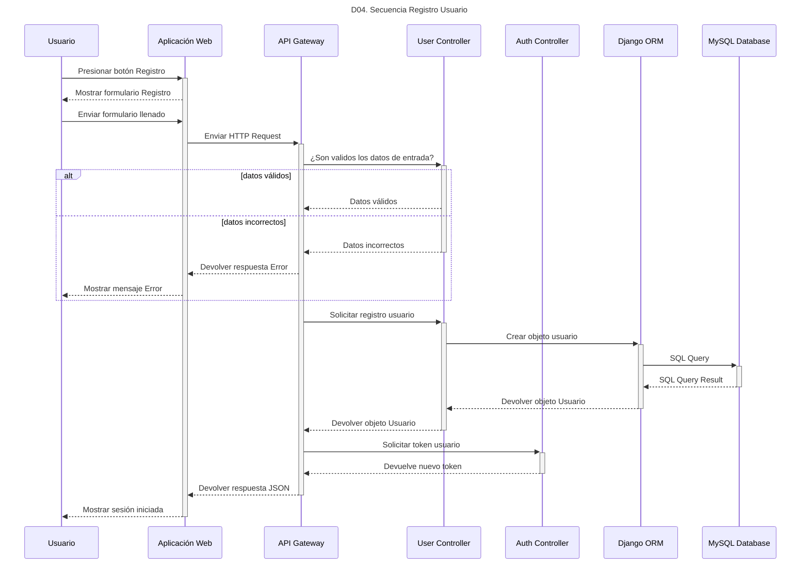

# D04. Secuencia Registro Usuario

```mermaid
sequenceDiagram
    Title: D04. Secuencia Registro Usuario
    participant User as Usuario
    participant WebApp as Aplicación Web
    participant API as API Gateway
    participant UserC as User Controller
    participant AuthC as Auth Controller
    participant DjangoORM as Django ORM
    participant MySQLDB as MySQL Database
    User->>+WebApp: Presionar botón Registro
    WebApp-->>User: Mostrar formulario Registro
    User->>WebApp: Enviar formulario llenado
    WebApp->>+API: Enviar HTTP Request
    API->>+UserC: ¿Son validos los datos de entrada?
    alt datos válidos
        UserC-->>API: Datos válidos   
    else datos incorrectos
        UserC-->>-API: Datos incorrectos
        API-->>WebApp: Devolver respuesta Error
        WebApp-->>User: Mostrar mensaje Error
    end
    API->>+UserC: Solicitar registro usuario
    UserC->>+DjangoORM: Crear objeto usuario
    DjangoORM->>+MySQLDB: SQL Query
    MySQLDB-->>-DjangoORM: SQL Query Result
    DjangoORM-->>-UserC: Devolver objeto Usuario
    UserC-->>-API: Devolver objeto Usuario
    API->>+AuthC: Solicitar token usuario
    AuthC-->>-API: Devuelve nuevo token
    API-->>-WebApp: Devolver respuesta JSON
    WebApp-->>-User: Mostrar sesión iniciada
```
