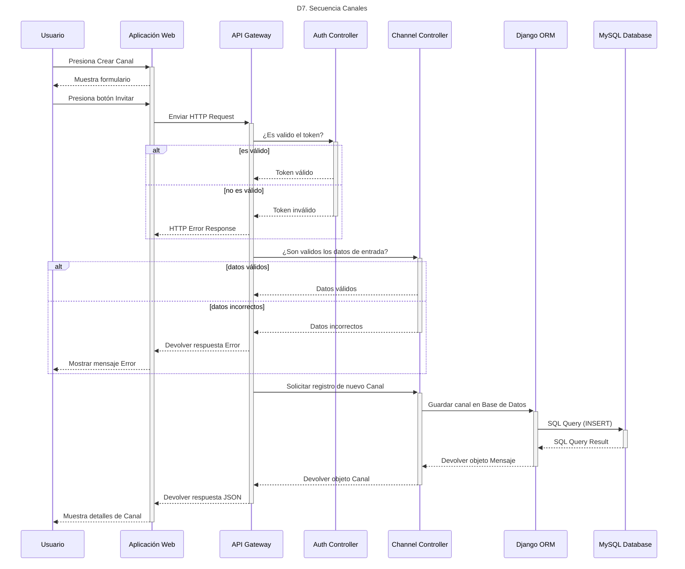

# D7. Secuencia Canales

```mermaid
sequenceDiagram
    Title: D7. Secuencia Canales
    participant User as Usuario
    participant WebApp as Aplicación Web
    participant API as API Gateway
    participant AuthC as Auth Controller
    participant ChannelC as Channel Controller
    participant DjangoORM as Django ORM
    participant MySQLDB as MySQL Database
    User->>+WebApp: Presiona Crear Canal
    WebApp-->>User: Muestra formulario
    User->>WebApp: Presiona botón Invitar
    WebApp->>+API: Enviar HTTP Request
    API->>+AuthC: ¿Es valido el token?
    alt es válido
        AuthC-->>API: Token válido   
    else no es válido
        AuthC-->>-API: Token inválido
        API-->>WebApp: HTTP Error Response
    end
    API->>+ChannelC: ¿Son validos los datos de entrada?
    alt datos válidos
        ChannelC-->>API: Datos válidos   
    else datos incorrectos
        ChannelC-->>-API: Datos incorrectos
        API-->>WebApp: Devolver respuesta Error
        WebApp-->>User: Mostrar mensaje Error
    end
    API->>+ChannelC: Solicitar registro de nuevo Canal
    ChannelC->>+DjangoORM: Guardar canal en Base de Datos
    DjangoORM->>+MySQLDB: SQL Query (INSERT)
    MySQLDB-->>-DjangoORM: SQL Query Result
    DjangoORM-->>-ChannelC: Devolver objeto Mensaje
    ChannelC-->>-API: Devolver objeto Canal
    API-->>-WebApp: Devolver respuesta JSON
    WebApp-->>-User: Muestra detalles de Canal
```
